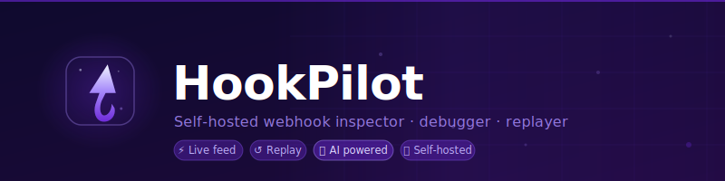

<div align="center">
  <br/>
  
  <h1>HookPilot</h1>
  <p><strong>Self-hosted webhook inspector, debugger and replayer.</strong><br/>
  The open-source alternative to RequestBin and Hookdeck — with AI built in.</p>

  <p>
    
    
    
    
    
  </p>

  <p>
    <a href="#-quick-start">Quick Start</a> ·
    <a href="#-ai-features">AI Features</a> ·
    <a href="#-rest-api">REST API</a> ·
    <a href="#-configuration">Configuration</a>
  </p>

  <br/>
  
  <br/><br/>
</div>

---

## Why HookPilot?

**RequestBin is dead. Webhook.site has no persistent storage on the free tier. Hookdeck costs $25/month.** HookPilot runs on your own server, stores everything, and ships features none of the paid tools have — including AI payload analysis and automatic handler code generation.

| | HookPilot | RequestBin | Webhook.site | Hookdeck |
|---|:---:|:---:|:---:|:---:|
| Self-hosted | ✅ | ❌ | ❌ | ❌ |
| Persistent storage | ✅ | ❌ | limited | ✅ |
| Real-time live feed | ✅ | ✅ | ✅ | ✅ |
| Request replay | ✅ | ❌ | ❌ | ✅ |
| Auto-forward | ✅ | ❌ | ❌ | ✅ |
| AI explain + codegen | ✅ | ❌ | ❌ | ❌ |
| Telegram alerts | ✅ | ❌ | ❌ | ❌ |
| Export as curl | ✅ | ❌ | ✅ | ❌ |
| Price | **Free** | Free (dead) | Free (limited) | $25/mo |

---

## ✨ Features

- **🪣 Buckets** — Named channels, each with its own capture URL (`/w/your-bucket`)
- **⚡ Live feed** — New requests appear instantly via Server-Sent Events — no polling, no refresh
- **🔍 Full inspection** — Method, headers, JSON-highlighted body, query params — all at a glance
- **✨ AI Explain** — One click: AI reads the payload and tells you what happened in plain English
- **🤖 Handler generator** — AI writes a production-ready handler in Python, JS, TypeScript, Go, PHP or Ruby
- **↺ Replay** — Resend any captured request to a different URL and see the response + latency
- **⇒ Auto-forward** — Every incoming request optionally proxied to your local dev server automatically
- **📋 Export as curl** — Copy any request as a ready-to-run shell command
- **🔔 Telegram alerts** — Get a message on Telegram when a webhook arrives (per-bucket, optional)
- **🐳 Docker-first** — `docker compose up` and you're done. SQLite embedded, zero external dependencies

---

## 🚀 Quick Start

```bash
git clone https://github.com/colapsis/hookpilot.git
cd hookpilot
cp .env.example .env          # edit BASE_URL to your server's address
docker compose up -d
open http://localhost:8000
```

Then point any service at your capture URL:

```bash
curl -X POST http://localhost:8000/w/my-bucket \
  -H "Content-Type: application/json" \
  -d '{"event": "payment.completed", "amount": 9900}'
# → {"ok": true, "id": "abc-123"}
```

Open `http://localhost:8000` to see it appear in real time.

### Without Docker

```bash
python -m venv .venv && source .venv/bin/activate
pip install -r requirements.txt
cp .env.example .env
uvicorn app.main:app --reload --port 8000
```

---

## ✨ AI Features

HookPilot supports **any LLM provider** via [LiteLLM](https://github.com/BerriAI/litellm). Set two env vars and the AI panel appears automatically.

### Explain
Click **Explain** on any captured request. In ~1 second you get:

> *"Stripe subscription cancelled — plan Pro, customer john@example.com, reason: payment_failed"*

Plus the detected source service, event type, and the most important fields extracted and labelled — no more squinting at raw JSON.

### Generate Handler
Pick a language and get a ready-to-paste handler for that exact payload:

<details>
<summary><b>Python example (click to expand)</b></summary>

```python
from dataclasses import dataclass

# Stripe customer.subscription.deleted — fires when a subscription is cancelled
@dataclass
class SubscriptionEvent:
    id: str
    customer: str
    status: str
    plan_name: str
    cancel_reason: str

def handle_subscription_cancelled(payload: dict) -> None:
    event = SubscriptionEvent(
        id=payload["data"]["object"]["id"],
        customer=payload["data"]["object"]["customer"],
        status=payload["data"]["object"]["status"],
        plan_name=payload["data"]["object"]["plan"]["nickname"],
        cancel_reason=payload["data"]["object"].get("cancellation_details", {}).get("reason", ""),
    )
    # TODO: add your business logic here
    # e.g. downgrade user, send cancellation email, update database
```
</details>

### Setup (any provider)

```bash
# Groq — fastest, generous free tier
AI_MODEL=groq/llama-3.1-8b-instant
GROQ_API_KEY=gsk_...

# OpenAI
AI_MODEL=gpt-4o-mini
OPENAI_API_KEY=sk-...

# Anthropic Claude
AI_MODEL=claude-haiku-3-5-20251001
ANTHROPIC_API_KEY=sk-ant-...

# Google Gemini
AI_MODEL=gemini/gemini-2.0-flash
GEMINI_API_KEY=...

# Mistral
AI_MODEL=mistral/mistral-small-latest
MISTRAL_API_KEY=...

# Local Ollama (no key, no cost)
AI_MODEL=ollama/llama3
```

> **AI is completely optional.** If `AI_MODEL` is not set, the buttons are hidden and no API is ever called.

---

## ⚙️ Configuration

All settings via environment variables or `.env` file:

| Variable | Default | Description |
|---|---|---|
| `BASE_URL` | `http://localhost:8000` | Public URL shown in webhook links |
| `AI_MODEL` | _(empty)_ | LiteLLM model string — enables AI features |
| `TELEGRAM_BOT_TOKEN` | _(empty)_ | Telegram bot token from @BotFather |
| `REQUEST_RETENTION_DAYS` | `30` | Auto-delete requests older than N days (0 = keep forever) |
| `MAX_REQUESTS_PER_BUCKET` | `500` | Per-bucket cap; oldest deleted first |
| `MAX_BODY_SIZE` | `524288` | Max captured body in bytes (512 KB) |
| `DATABASE_PATH` | `./data/hookpilot.db` | SQLite file location |

Provider API keys (`OPENAI_API_KEY`, `ANTHROPIC_API_KEY`, `GROQ_API_KEY`, etc.) are read directly from the environment by LiteLLM. See [`.env.example`](.env.example) for the full list.

---

## 🌐 Deploying on a VPS

```bash
echo "BASE_URL=https://hooks.yourdomain.com" >> .env
docker compose up -d
```

**nginx reverse proxy** (required for SSE live feed):

```nginx
server {
    listen 443 ssl;
    server_name hooks.yourdomain.com;

    location / {
        proxy_pass         http://127.0.0.1:8000;
        proxy_set_header   Host $host;
        proxy_set_header   X-Real-IP $remote_addr;

        # Critical for Server-Sent Events (live feed)
        proxy_buffering    off;
        proxy_cache        off;
        proxy_read_timeout 3600s;
    }
}
```

---

## 🔌 REST API

Interactive docs available at `/api/docs` on your running instance.

```
GET    /              Dashboard
GET    /b/{slug}       Bucket view (live)
GET    /r/{id}         Request detail

POST   /api/buckets            Create bucket
PATCH  /api/buckets/{slug}     Update settings
DELETE /api/buckets/{slug}     Delete bucket

GET    /api/buckets/{slug}/requests    List requests
GET    /api/requests/{id}              Get request + replays
DELETE /api/requests/{id}              Delete request
GET    /api/requests/{id}/curl         Export as curl command
POST   /api/requests/{id}/replay       Replay to URL
POST   /api/requests/{id}/explain      AI: explain payload   ✨
POST   /api/requests/{id}/codegen      AI: generate handler  🤖
GET    /api/ai/status                  AI enabled + model
GET    /api/stream/{slug}              SSE live event stream
GET    /api/stats                      Global stats

ANY    /w/{slug}               ← Webhook capture endpoint
```

---

## 🛠 Tech Stack

| Layer | Technology |
|---|---|
| Backend | [FastAPI](https://fastapi.tiangolo.com/) + [aiosqlite](https://github.com/omnilib/aiosqlite) |
| Frontend | [htmx](https://htmx.org/) + [Tailwind CSS](https://tailwindcss.com/) (CDN, no build step) |
| AI | [LiteLLM](https://github.com/BerriAI/litellm) — 100+ providers |
| Realtime | Server-Sent Events (SSE) |
| Database | SQLite (embedded, no server) |
| Notifications | Telegram Bot API |
| Syntax highlighting | [Prism.js](https://prismjs.com/) |

---

## 🤝 Contributing

Issues and PRs are welcome. To run locally:

```bash
git clone https://github.com/colapsis/hookpilot.git
cd hookpilot
python -m venv .venv && source .venv/bin/activate
pip install -r requirements.txt
uvicorn app.main:app --reload --port 8000
```

---

## 📄 License

[MIT](LICENSE) — free to use, modify and self-host.

---

<div align="center">
  <p>
    <a href="https://github.com/colapsis/hookpilot/stargazers">
      
    </a>
  </p>
  <sub>If HookPilot saves you time, a ⭐ on GitHub goes a long way.</sub>
</div>
